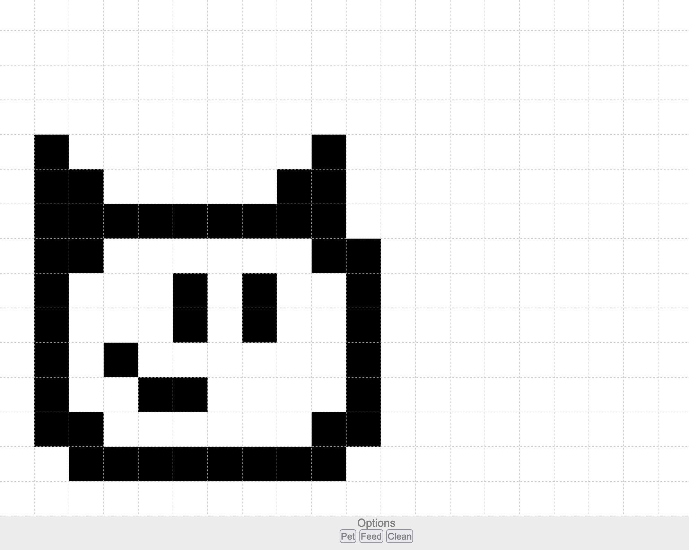

# digipet
## The Tamagotchi Mimic

Egg appears, hatches into a mini pet who can be fed, petted, and cleaned.
The digipet becomes soiled after being fed multiple times.

Display of the pet appears using a 2d Array pattern that is passed when the grid is created on screen.
